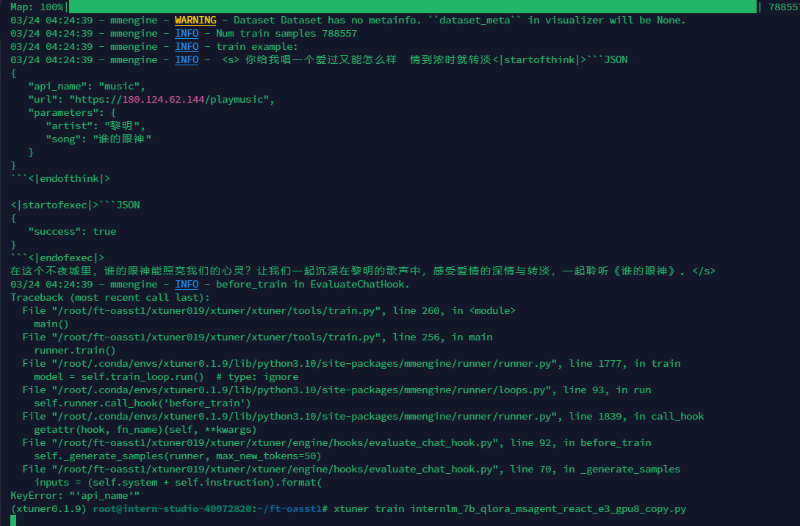

对于出现上述错误，一般是构建链路格式化出现的问题，请检查数据集中的`system`字段是否存在tools工具链路格式是否正确可通过下面的代码对system进行检查

```python
SYSTEM_PLUGINS = [
    {'api_name': 'get_permissions', 'description': '权限查询', 'parameters': []},
    {'api_name': 'business_data_q', 'description': '业务数据查询', 'parameters': [
        {'name': 'role', 'description': '用户角色', 'type': 'str', 'required': True},
        {'name': 'data_source', 'description': '数据载体', 'type': 'str', 'required': True},
        {'name': 'time_range', 'description': '时间范围', 'type': 'str', 'required': True}
    ]},
    {'api_name': 'wake_overdue_plan', 'description': '欠费补缴', 'parameters': [
        {'name': 'role', 'description': '用户角色', 'type': 'str', 'required': True},
        {'name': 'data_source', 'description': '数据载体', 'type': 'str', 'required': True},
        {'name': 'time_range', 'description': '时间范围', 'type': 'str', 'required': True}
    ]}
]
plugen=[{'api_name': 'get_permissions', 'description': '权限查询', 'parameters': []}, {'api_name': 'business_data_q', 'description': '业务数据查询', 'parameters': [{'name': 'role', 'description': '用户角色', 'type': 'str', 'required': True}, {'name': 'data_source', 'description': '数据载体', 'type': 'str', 'required': True}, {'name': 'time_range', 'description': '时间范围', 'type': 'str', 'required': True}]}, {'api_name': 'wake_overdue_plan', 'description': '欠费补缴', 'parameters': [{'name': 'role', 'description': '用户角色', 'type': 'str', 'required': True}, {'name': 'data_source', 'description': '数据载体', 'type': 'str', 'required': True}, {'name': 'time_range', 'description': '时间范围', 'type': 'str', 'required': True}]}]

# 将插件信息列表转换为字符串
plugin_info_str = '\n'.join([f"{plugin['api_name']}: {plugin['description']}, " +
                             ", ".join([f"{param['name']}: {param['description']}, {param['type']}, {param['required']}" for param in plugin['parameters']])
                             for plugin in haolsos_plugen])
"""
SYSTEM = (
    "你是BAgpt（业务助手），你是个大语言模型，是2024年好老师的工程师训练得到的。"
    "今天是2024年3月23日，你有多种能力，可以通过插件集成考研系统api来回复用户的问题。"
    "目前支持的插件信息如下，请自行判断是否需要调用插件来解决当前用户问题。"
    "若需要调用插件，则需要将插件调用请求按照json格式给出，"
    "必须包含api_name、parameters字段，并在其前后使用和作为标志。"
    "然后你需要根据插件API调用结果生成合理的答复；若无需调用插件，则直接给出对应回复即可：\n"
    f"{plugin_info_str}"
)
"""
SYSTEM=("填写你的系统提示词")
prompt_template = dict(
    SYSTEM='<|System|>:{system}\n',
    INSTRUCTION='<|User|>:{input}\n<|Bot|>:',
    SEP='\n')
sample_input = "input测试数据"
system = prompt_template.get(
    'SYSTEM', '{system}\n').format(system=SYSTEM)
instruction = prompt_template.get('INSTRUCTION', '{input}')
print(instruction)
inputs = (system + instruction).format(
    input=sample_input, round=1)
print(inputs)
```


```cmd
03/24 04:24:39 - mmengine - WARNING - Dataset Dataset has no metainfo. ``dataset_meta`` in visualizer will be None.
03/24 04:24:39 - mmengine - INFO - Num train samples 788557
03/24 04:24:39 - mmengine - INFO - train example:
03/24 04:24:39 - mmengine - INFO -  <s> 你给我唱一个爱过又能怎么样　情到浓时就转淡<|startofthink|>```JSON
{
   "api_name": "music",
   "url": "https://180.124.62.144/playmusic",
   "parameters": {
      "artist": "黎明",
      "song": "谁的眼神"
   }
}
```<|endofthink|>

<|startofexec|>```JSON
{
   "success": true
}
```<|endofexec|>
在这个不夜城里，谁的眼神能照亮我们的心灵？让我们一起沉浸在黎明的歌声中，感受爱情的深情与转淡，一起聆听《谁的眼神》。</s>
03/24 04:24:39 - mmengine - INFO - before_train in EvaluateChatHook.
Traceback (most recent call last):
  File "/root/ft-oasst1/xtuner019/xtuner/xtuner/tools/train.py", line 260, in <module>
    main()
  File "/root/ft-oasst1/xtuner019/xtuner/xtuner/tools/train.py", line 256, in main
    runner.train()
  File "/root/.conda/envs/xtuner0.1.9/lib/python3.10/site-packages/mmengine/runner/runner.py", line 1777, in train
    model = self.train_loop.run()  # type: ignore
  File "/root/.conda/envs/xtuner0.1.9/lib/python3.10/site-packages/mmengine/runner/loops.py", line 93, in run
    self.runner.call_hook('before_train')
  File "/root/.conda/envs/xtuner0.1.9/lib/python3.10/site-packages/mmengine/runner/runner.py", line 1839, in call_hook
    getattr(hook, fn_name)(self, **kwargs)
  File "/root/ft-oasst1/xtuner019/xtuner/xtuner/engine/hooks/evaluate_chat_hook.py", line 92, in before_train
    self._generate_samples(runner, max_new_tokens=50)
  File "/root/ft-oasst1/xtuner019/xtuner/xtuner/engine/hooks/evaluate_chat_hook.py", line 70, in _generate_samples
    inputs = (self.system + self.instruction).format(
KeyError: "'api_name'"
```

当将全部数据放入会存在api_name问题，后期会对数据集进行检查

错误原因在于 数据要求为conversation 部分数据为conversations

同时需要将钩子注释掉 或者说更改钩子函数

数据为：['data.json','haolaos.json','train_0.json']

报错：


检查自己的数据映射函数是否正确，正确格式如下：


如果不想编写数据映射函数请将以下字段更改为None

```python
dataset_map_fn=None,
template_map_fn=None,
```
